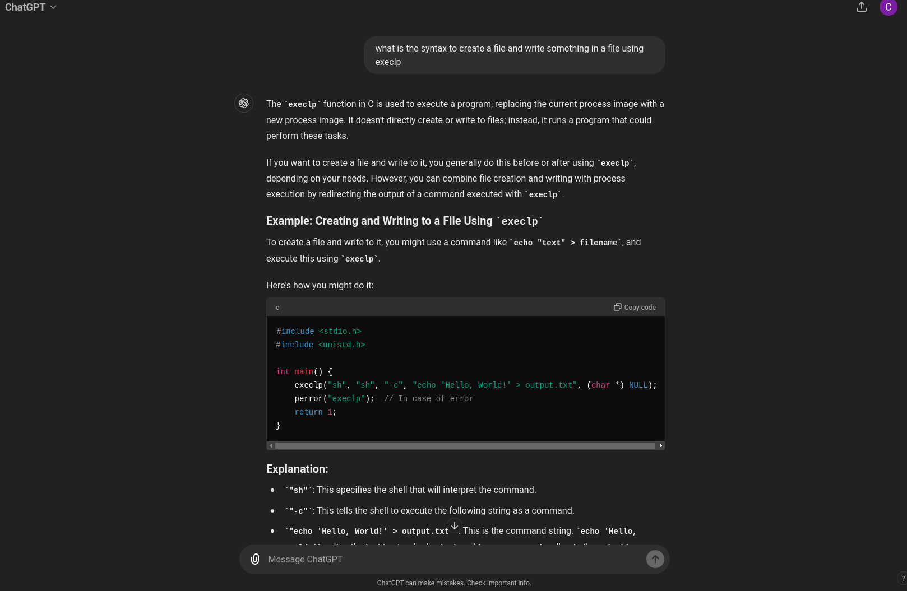
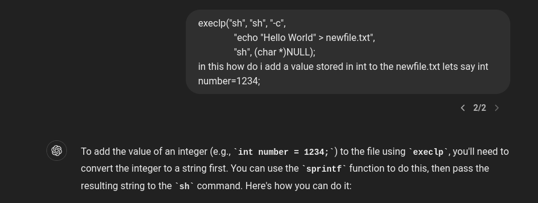
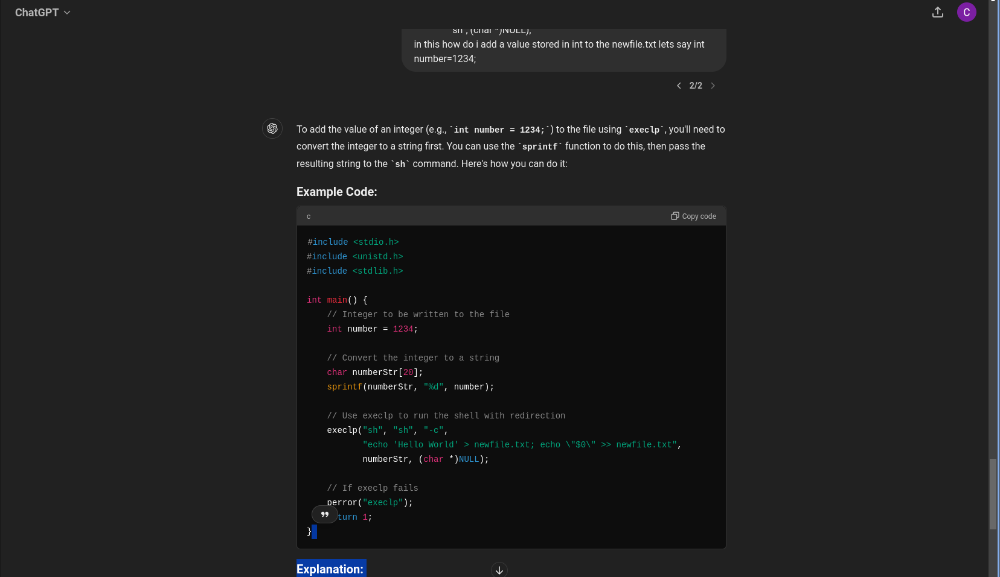

# PART1

# C Program for Command-Line File Operations

This C program provides a simple command-line interface that allows users to execute specific commands to interact with a file (`newfile.txt`). The program supports three main commands: `PRINT`, `INPUT`, and `STOP`. The program demonstrates concepts like file handling, duplicating file descriptors, and redirecting standard input/output.

### Commands

- **PRINT**: Redirects the standard input (`stdin`) from the terminal to the file `newfile.txt`, reads the content from the file, and prints it to the terminal. This command allows you to view the contents of `newfile.txt` on the console.

- **INPUT**: Prompts the user to enter a message, which is then appended to the file `newfile.txt`. The standard output (`stdout`) is temporarily redirected to write directly to the file. After writing the message, the program restores the standard output.

- **STOP**: Terminates the program.

### Flow of Execution

1. **User Input**: The program runs in an infinite loop, waiting for the user to enter a command.
2. **Command Handling**:
   - If the user enters `PRINT`, the program reads from `newfile.txt` and prints the content to the terminal.
   - If the user enters `INPUT`, the program prompts the user for a message and writes it to `newfile.txt`.
   - If the user enters `STOP`, the program exits the loop and terminates.
   - For any other command, the program prints an error message and prompts the user to enter a valid command.

## File Operations

The program uses the following system calls for file operations:

- `open()`: To open `newfile.txt` for reading or writing.
- `dup()`: To duplicate the file descriptor for standard input or output.
- `dup2()`: To redirect standard input/output to the file descriptor of `newfile.txt`.
- `close()`: To close file descriptors after operations are complete.

## Error Handling

The program includes error checking for all file operations. If any operation fails (e.g., opening a file or duplicating a file descriptor), the program prints an error message and exits.

# PART2

Here's a `README.md` file for your C program:

---

# C Program for Process Management and File Operations

This C program demonstrates various process management tasks using `fork()`, `exec()`, `wait()`, and file operations. It includes three main tasks:

1. Modifying variables in child and parent processes.
2. Creating a child process that writes the parent process ID to a file.
3. Creating a child process that runs after the parent process exits.

## How It Works

### Task 1: Variable Modification in Child and Parent Processes

- **Purpose**: To demonstrate that variables in child and parent processes are independent.
- **Process**:
  - The program initializes an integer `x` with a value of 25.
  - A child process is created using `fork()`.
  - In the child process, the value of `x` is changed to 9 and printed.
  - The parent process waits for the child to complete, then prints the value of `x` and changes it to 4.

### Task 2: Writing Parent Process ID to a File

- **Purpose**: To demonstrate how to use `execlp()` to execute a shell command within a child process and write the output to a file.
- **Process**:
  - A new child process is created using `fork()`.
  - The child process uses `execlp()` to execute a shell command that writes the parent process ID to a file named `newfile.txt`.
  - The parent process waits for the child to complete before continuing.

### Task 3: Orphan Process Creation

- **Purpose**: To demonstrate orphan process creation, where a child process is adopted by the `init` process after the parent exits.
- **Process**:
  - Another child process is created using `fork()`.
  - The child process sleeps for 1.75 seconds, allowing the parent to exit.
  - After waking up, the child process prints its new parent process ID, which should be `1` (indicating adoption by the `init` process).

- **Orphan Processes**: Demonstrating process adoption by `init`.

### use of AI in part2

  
  
  
